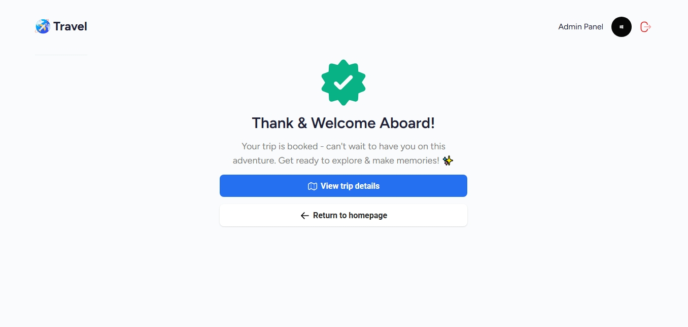

# AI Travel Dashboard

Welcome to the AI Travel Dashboard! This project is a modern, full-stack web application designed to simplify travel planning using AI-generated itineraries. It provides users with a seamless experience to create, view, and manage travel plans tailored to their preferences.

---

## Features

### Core Features

- **AI-Generated Itineraries**: Generate travel plans based on user preferences such as budget, interests, travel style, and group type.
- **Interactive Maps**: Visualize travel destinations on a world map.
- **Trip Management**: View trip details, edit plans, and explore popular trips.
- **Authentication**: Secure user login and account management.
- **Payment Integration**: Stripe integration for trip payments.
- **Authentication Integration**: Login with Google and GitHub provides

### Admin Features

- **Dashboard**: View user and trip statistics.
- **User Management**: Manage user accounts and roles.
- **Trip Insights**: Analyze trips by travel style and growth trends.

---

## Technologies Used

### Frontend

- **React**: For building the user interface.
- **React Router**: For routing and server-side rendering.
- **Tailwind CSS**: For styling and responsive design.
- **Syncfusion Components**: For advanced UI elements like maps, grids, and dropdowns.

### Backend

- **Appwrite**: For database, authentication, and storage.
- **Node.js**: For server-side logic.
- **Google GenAI**: For generating AI-based travel itineraries.
- **Stripe**: For payment processing.

### Dev Tools

- **TypeScript**: For type-safe development.
- **Vite**: For fast builds and development.
- **Docker**: For containerized deployment.
- **Sentry**: For error tracking and monitoring.

---

## Project Structure

### Folder Overview

- **app/**: Contains the main application code, including routes, components, and styles.
- **components/**: Reusable UI components like `Header`, `TripCard`, and `InfoPill`.
- **lib/**: Utility functions and integrations like `stripe.ts` and `utils.ts`.
- **images/**: Static assets used in the application.
- **appwrite/**: Appwrite client configuration and API integrations.

### Key Files

- `app/routes/admin/trips/CreateTrip.tsx`: Component for creating new trips.
- `app/routes/admin/trips/TripDetails.tsx`: Component for viewing trip details.
- `appwrite/client.ts`: Appwrite client setup.
- `lib/utils.ts`: Utility functions for parsing and formatting data.

---

## Development Process

### Learning and Implementation

This project was inspired by a YouTube video tutorial where the creator built a dashboard. I followed the video to learn how to structure the dashboard and implement its features. After completing the dashboard, I extended the project by adding client pages, Stripe integration for payments, and other enhancements to make it a complete travel planning application.

---

## Installation

### Prerequisites

- Node.js
- Docker (optional for deployment)

### Steps

1. Clone the repository:
   ```bash
   git clone https://github.com/your-repo/ai-travel-dashboard.git
   cd ai-travel-dashboard
   ```
2. Install dependencies:
   ```bash
   npm install
   ```
3. Start the development server:
   ```bash
   npm run dev
   ```

---

## Images

Below are the images used in the project:

### Home Page


### Trip Details


### Payment


### Payment Success



### Dashboard


### Dashboard Trips


### All Users


### Create Trip


### Login


